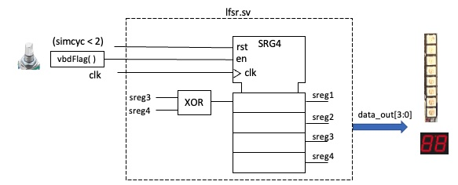
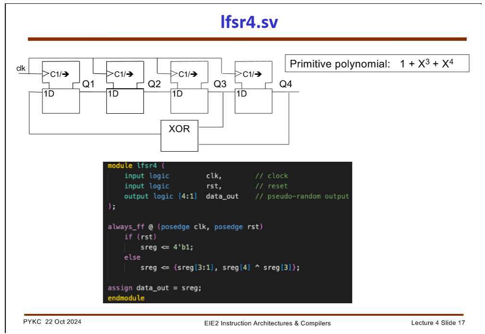
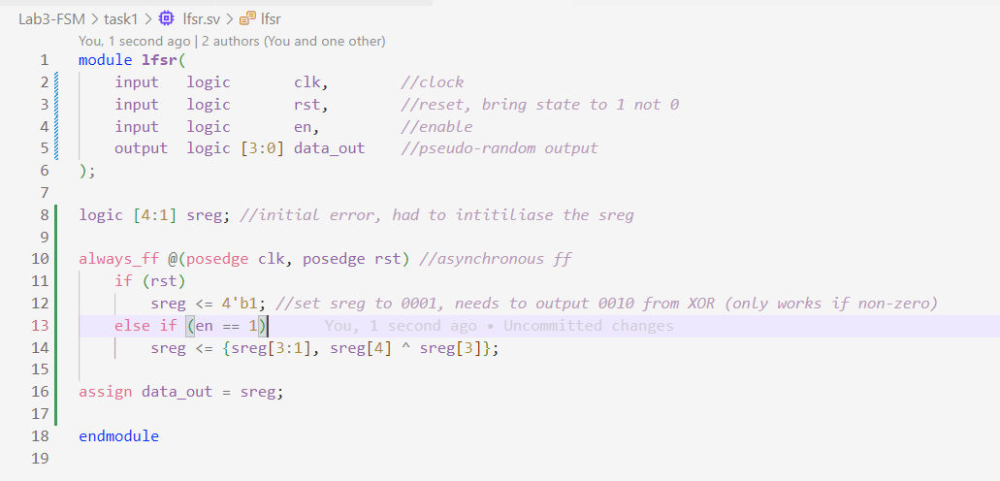
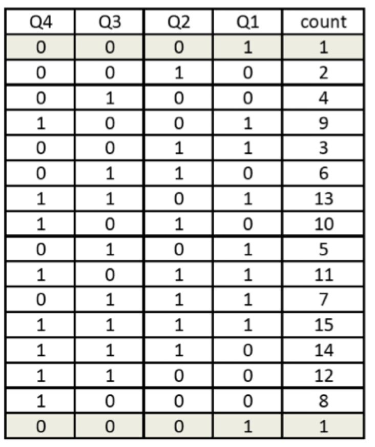
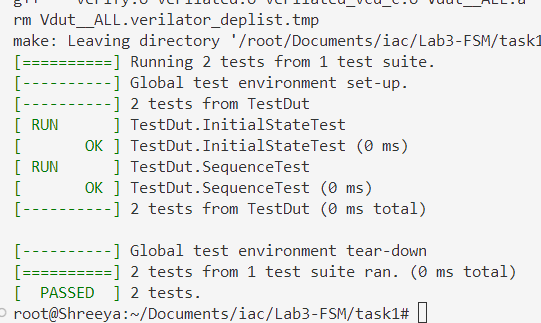
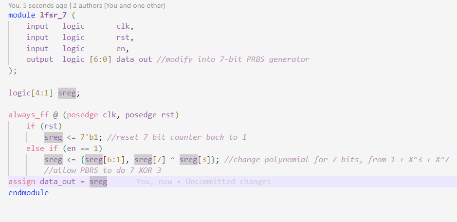

## Task 1 - 4-bit LFSR and Pseudo Random Binary Sequence

# Step 1 - create component lfsr.sv

Here I created my top level circuit in the component *lfsr.sv* 

Here, all 4 bits of the shift register are brought out as *data_out[3:0]*. *en* is the enable signal, and *rst* brings is back to 1 not 0.

This was my code:

It creates the module specified in the lecture slide. This is a linear feedback shift register; it's a cascade of flip-flops where the output of one flip-flop is connected to the input of the next. The input of *sreg[1]* is *(sreg[4] XOR sreg[3])*.

In the testbench, we run *rst* in the first cycle to make sure the intial value in the register is something other than 4'b0000.

This acts as a 4-bit counter, where the values repeat every $2^(n-1)$ cycles.

In this, the primitive polynomial is $ 1 + X^3 + X^4 $, where the exponents determine on what indexes of the register were XOR-ed together.

I verified and it worked.

# Challenge
For the challenge, we had to modify a 4-bit into a 7-bit PRBS generator.

The primitive polynomial for this is $ 1 + X^3 + X^7 $

The two main changes were the bit widths, and the XOR values to implement the primitive polynomial.

