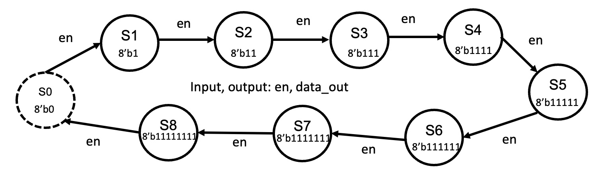
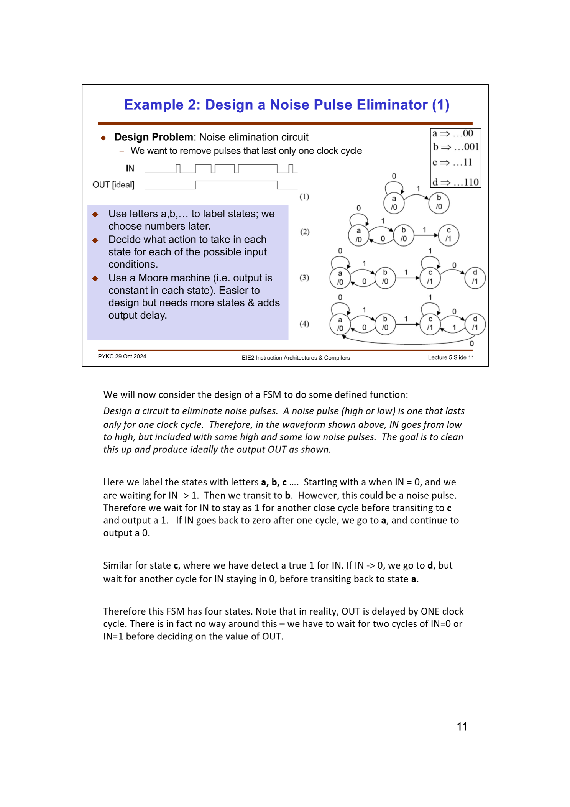
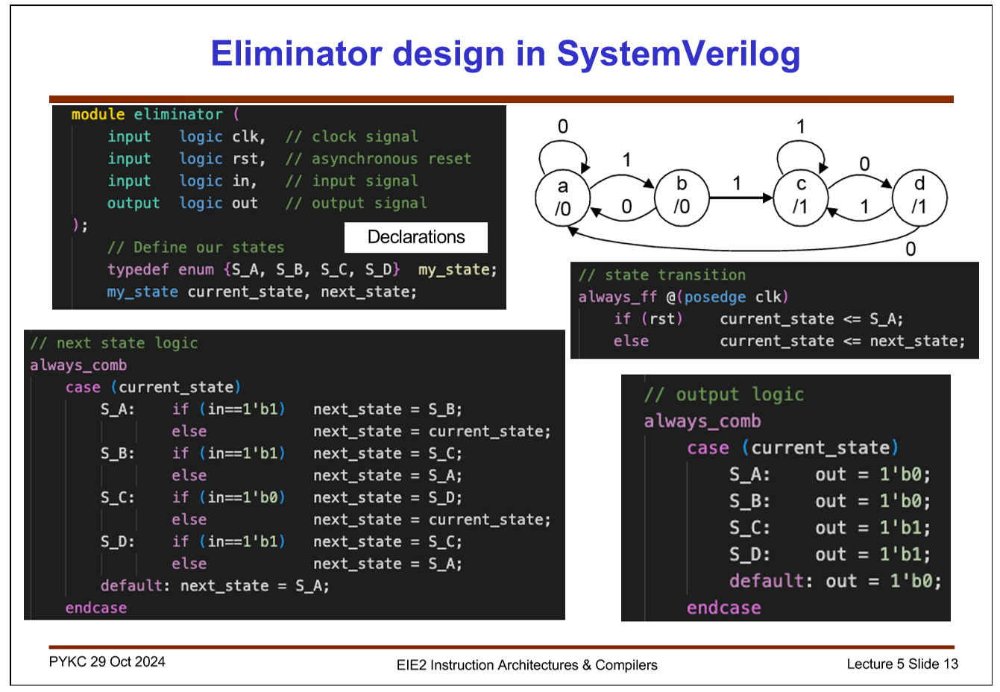
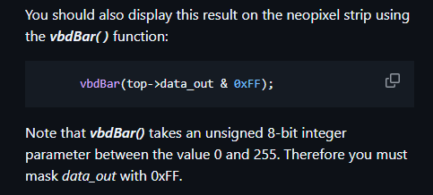

## Task 2 - Formula 1 Light Sequence

We want to create a FSM that cycles through the sequence according to this FSM:

I used these to help me along:

Here we define the states, define the state tranistions at the positive *clk* edge.

We define the *next state logic* too, where the conditional is handles in state transition; the only condition is that the state should change when the enable is one. This means the purpose of that block is just to specify the next_state for each state.

The output logic block specifies rhe output for each state; each number corresponds to an LED in the neopixel bar.

I verified and it worked.

# Step 3: Connect the FSM to Vbuddy
I wrote the testbench *f1_fsm_tb.cpp* to drive the neopixel bar and cycle through the f1 Light Sequence. I used the rotary switch with the *vbdFlag()* functoin in mode 1 to drive the en signal as show below.

I displayd the result on the neopixel strip using:

The output was as expected.