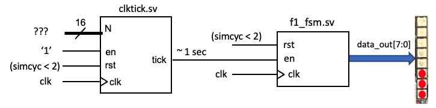

## Task 3: Exploring the clktick.sv and the delay.sv modules

In this task we wanted to understand the flexible timer from the *clktick.sv* module. 

The testbench flashes the neopixel strip LEDs on and off at a rate determined by N. Our goal is to calibrate the circuit (under simulation) to find what value of N gives us a tick period of 1 sec.

I compiled the sv module, and used a metronome at 60 bpm to generate a tick period of 1 second. This was done through adjusting the rotary switch to change the flash rate of the neopixels to match the metronome.

The reason that we need to do this calibration is that the Verilator simulation of your design is NOT in real time. Every computer will work at different rate and therefore takes different amount of time to simulate one cycle of the clock signal clk. For a 14" M1 Macbook Pro (my computer), N is around 24 for a tick period of 1 sec (i.e. one tick pulse every second).

# Challenge: Implement the design below by combining clktick.sv and f1_fsm.sv so the F1 light sequence is cycled through automatically with 1 second delay per state transition.

The output of the flexible timer is the enable input of the finite state machine. Every time the timer generates a tick signal, the finite state machine goes to it's next state. This means we can use the flexibe timer to control the delay between each state transition.

I set the rotary encoder to 24 - this meant the *vbdValue() = N = 24*. This means there was a delay of 24 cycles between consecutive ticks (1 second in real time). Hence the f1 state machine changes state every second.

Rotating the encoder changed the value of *vbdValue()*, which either increased/decreased the tick period depending on what you're trying to achieve.
